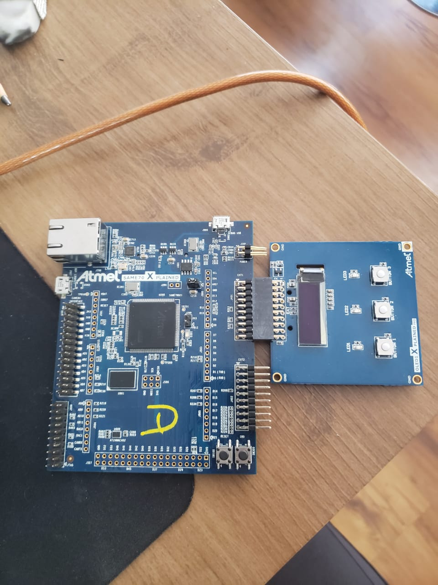
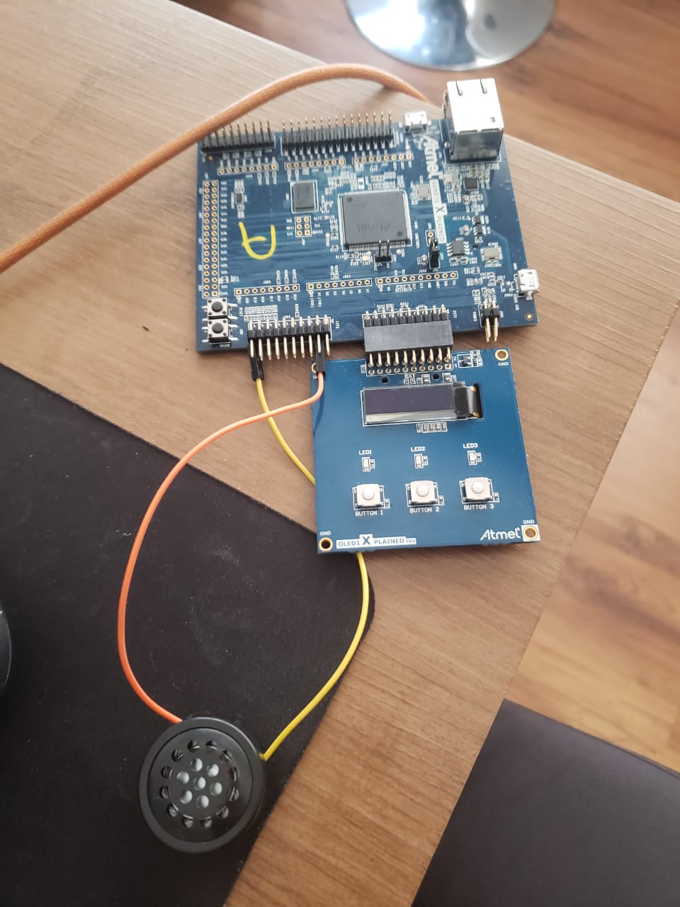

# Sistemas Embarcados - APS1

## Descrição
Criamos o projeto como o intuito de fazer um embarcado que simula uma caixinha de musicas.

## Intrumentos
- `1x Atmel SAME70`
- `1x OLED1`
- `1x Buzzer 5V`
- `2x Jumpers Fêmea-Solda`

## Foto do Hardware

### OLED1 Xplained + Atmel SAME70 Xplained

### Buzzer na EXT2 nos Pinos +(Vcc/PC13)-

## Configuração do código fonte
A lógica esta no arquivo [`main.c`](/src/main.c).

Musicas:
1. [`Piratas do Caribe`](/src/musicas.h)
2. [`Under World`](/src/musicas.h)
3. [`Marcha Imperial`](/src/musicas.h)

O arquivo [`Musicas`](/src/musicas.h) contem todas as musicas e foi fornecido por [`Bruno Arthur Cesconetto`](https://github.com/brunoartc/) 

## Configuração dos botões e LED's
- Botões:
  1. O `Button 1` da placa `OLED1` serve para tocar a musica Piratas do Caribe.
  2. O `Button 2` da placa `OLED1` serve para tocar a musica Marcha Imperial.
  3. O `Button 3` da placa `OLED1` serve para tocar a musica Under World.
  4. O `Button OnBoard` da placa `Atmel` serve para pausar e dar play em uma musica.
- LED's:
  1. O `LED` da placa `Atmel SAME70 Xplained` pisca de acordo com a música sendo tocada.
  2. O `LED 1` da placa `OLED1` indica que vai tocar a musica Piratas do Caribe.
  3. O `LED 2` da placa `OLED1` indica que vai tocar a musica Marcha Imperial.
  4. O `LED 3` da placa `OLED1` indica que vai tocar a musica Under World.

## Video de demonstração

Plaquinha funcionando [aqui](https://youtu.be/i-tm3bHrrd4)

## Features implementadas de acordo com a [rúbrica](https://insper.github.io/ComputacaoEmbarcada/APS-1-Musical/)
- A (1 item embarcado + 1 item C)
  - Embarcado
    - [ ] Utiliza dois falantes (para fazer uma música mais complexa);
    - [x] Utiliza interrupção nos botões;
  - C
    - [x] Cria um arquivo .c .h com as funções de reprodução musical;
    - [x] Músicas organizadas em vetores de structs (ponteiros);

- B+
  - [x] Uma terceira música

- B
  - [x] [README.md](/README.md) explica o que é o projeto e como o software foi estruturado;
  - [x] Música separada em .h;
  - [x] Utiliza struct para organizar as músicas;
  - [x] Código organizado em funções e que recebem struct contendo música;
  - [x] Utiliza #define sempre que necessário;
  - [x] Fecha todos os issues que forem abertos no repositório (pelo professor);

- C
  - [x] Repositório contém [README.md](/README.md) com ligações elétrica e passos de como usar o projeto, assim como link para o vídeo;
  - [x] Funcionalidade de PAUSE/ PLAY;
  - [x] Botão de seleção musical;
  - [x] Reproduz duas músicas (de forma inteligível);
  - [x] LED piscando de acordo com a música;
  - [x] Indicação visual de qual música foi selecionada;

- D
  - [ ] Faltando um item de C

- I
  - [ ] Mais que dois itens de C faltando
